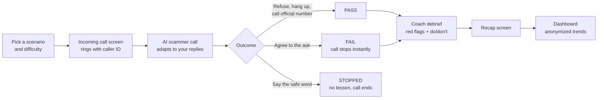
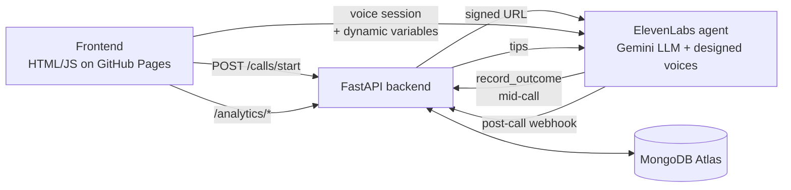

# PhonyBusiness

**Scammers rehearse their pitch every day. PhonyBusiness lets you rehearse your no.**

PhonyBusiness puts you on a realistic practice phone call with an AI scammer. The caller sounds real, adapts to everything you say, and pushes back the way real scammers do. Refuse, hang up, or say you'll call the official number, and you pass. Start to agree, and the call stops before anything sensitive is shared, then a coach walks you through the red flags you missed and what to do next time.

No real phone number. No real risk. Just practice.

**Try it:** [phonybusiness.study](https://phonybusiness.study)

Built at ShellHacks 2026.

---

## Why this exists

Imposter scams are the most reported fraud in the US. In 2025, the FTC received over a million imposter scam reports with more than $3.5 billion in losses ([FTC](https://www.ftc.gov/system/files/ftc_gov/pdf/ftc-testimony-jec-hearing-on-the-rising-scam-economy.pdf)), and reported fraud losses among adults 60 and over grew roughly fourfold between 2020 and 2024 ([FTC](https://www.ftc.gov/news-events/news/press-releases/2025/12/ftc-issues-annual-report-congress-agencys-actions-protect-older-adults)).

Awareness campaigns tell people what scams look like. But knowing the red flags on a flyer is different from saying no to a confident, urgent voice on the phone. Companies already run phishing simulations for email; PhonyBusiness does the same for voice, where the pressure is real-time and the stakes are highest.

## How it works



1. **Pick a scenario.** Choose one of 14 common phone scams and a difficulty from 1 (pushy and sloppy) to 3 (calm and polished).
2. **Answer the call.** A phone-style screen rings with a fake caller ID, like "Federal Benefits Office."
3. **Talk.** The AI scammer reads your stance every turn. Hesitant? It reassures you. Skeptical? It offers a fake badge number. Refusing? It pushes back once or twice, then gives up.
4. **Get your result.** The agent decides pass or fail the moment you commit either way. On a fail, it stops you before you share anything.
5. **Get coached.** The scammer persona drops away and a coach explains the red flags from your specific call, using vetted tips grounded in FTC guidance.
6. **See the bigger picture.** The dashboard shows which scams people fall for most, where they slip, and how they improve, without storing any conversation.

## Features

- **14 realistic scenarios** covering the FTC's top phone fraud categories, with fictional agencies, companies, and people only
- **A distinct designed voice for every scammer**, from a stern tax enforcer to a panicked grandson to a booming sweepstakes announcer
- **Adaptive conversations**: the agent tracks its own stage (hook, build trust, ask, pressure, close) and your stance (compliant, hesitant, skeptical, refusing)
- **Stop-before-disclosure design**: the scammer asks for your agreement, never your actual numbers, and agreement itself counts as a fail
- **Instant coaching** with specific do and don't guidance for each red flag you encountered
- **Safe word** that ends any call immediately, with no lesson and no judgment
- **Analytics dashboard** with overview, trends, risk, wellbeing, and operations views
- **Privacy by design**: we keep results, not conversations

## Built with ElevenLabs

PhonyBusiness is built on the ElevenLabs Agents platform, using:

| ElevenLabs feature | How PhonyBusiness uses it |
| --- | --- |
| **Conversational agent** | One agent plays every scammer, with Gemini as its LLM and a single system prompt covering the scam, outcome rules, safe word, and coach debrief |
| **Dynamic variables** | Each call injects the persona, the ask, the red flags, difficulty, safe word, first name, and our `call_id` |
| **Voice Design (v3)** | 14 custom voices generated from text descriptions, one per persona, created by script. No real person's voice is cloned |
| **Per-call voice override** | The frontend passes the scenario's voice ID when starting the session |
| **Server tool (webhook)** | `record_outcome` reports pass, fail, or stopped mid-call and returns debrief tips the coach reads from |
| **`call_id` as a dynamic-variable tool parameter** | The tool receives our call ID directly from the session, so the LLM never has to reproduce it |
| **End call system tool** | The agent hangs up on its own after the goodbye |
| **Signed URLs** | The backend creates short-lived session URLs, so the API key never reaches the browser |
| **Post-call webhook (HMAC-signed)** | Delivers timing, outcome, sentiment, latency, and cost for the dashboard |
| **Guardrails** | Focus and manipulation guardrails keep the agent on its training task and resist attempts to hijack it; content guardrails cover sexual content, violence, harassment, self-harm, profanity, politics and religion, and medical and legal information |
| **Built-in sentiment analysis** | Per-turn sentiment and frustration feed the dashboard's wellbeing view |

The full agent configuration, including the complete system prompt, tool setup, and lessons learned, is in [`ElevenLabsSetup.md`](ElevenLabsSetup.md).

## Scenarios

Every scenario is a phone call grounded in FTC consumer guidance, using only fictional agencies, companies, and people.

| Scenario | FTC category |
| --- | --- |
| Benefits imposter, tax debt, jury duty warrant | Government imposter |
| Bank fraud alert, suspicious order, utility shutoff | Business imposter |
| Tech support | Tech support imposter |
| Family emergency | Family imposter |
| Sweepstakes prize | Prizes, sweepstakes and lotteries |
| Health benefits card | Health care |
| Credit card interest | Debt relief |
| Investment opportunity | Investment |
| Mobile account | Telephone and mobile services |
| Vacation offer | Travel |

Each config in `backend/scenarios.py` has a persona, the scammer's ask, three red flags, and the caller name shown on the incoming call screen. Each red flag maps to do and don't guidance in `backend/tips.py`.

## Safety and privacy

A tool that makes realistic scam calls has to be impossible to turn into a scam tool. These guardrails are part of the design:

- **Fictional everything.** No real agencies, banks, or companies appear in any scenario.
- **Never asks for real data.** The scammer asks whether you're *willing* to verify, never for the actual number. Agreeing is the fail.
- **Safe word.** Saying it at any point ends the call immediately, with no debrief.
- **Platform guardrails.** ElevenLabs focus, manipulation, and content guardrails add a second layer of protection on top of the system prompt.
- **Honest when asked.** If you ask whether you're talking to an AI, the agent says yes.
- **No voice cloning.** Every voice is designed from a text description.
- **Neutral accents.** All scammer voices use a neutral American accent, so users don't learn the false cue that scammers "sound foreign." Real scammers sound like anyone.
- **Results, not conversations.** The backend never stores transcript text, names, conversation history, or call summaries. Dashboard breakdowns with fewer than `ANALYTICS_MIN_GROUP_SIZE` calls are suppressed so no individual can be singled out.

## Architecture



| Layer | Technology |
| --- | --- |
| Frontend | Plain HTML, CSS, and JavaScript (no build step), ElevenLabs JS client, hosted on GitHub Pages |
| Backend | FastAPI, Python 3.12, uv, Docker |
| Voice AI | ElevenLabs Agents with a Gemini Flash LLM |
| Database | MongoDB Atlas |

## Getting started

### Prerequisites

- Python 3.12+ and [uv](https://docs.astral.sh/uv/getting-started/installation/)
- A MongoDB Atlas cluster (the free tier works)
- An ElevenLabs account with an agent configured as described in [`ElevenLabsSetup.md`](ElevenLabsSetup.md)
- [ngrok](https://ngrok.com/) for local development with a live agent

### 1. Configure

```sh
uv sync
cp .env.example .env
```

| Variable | Required | Purpose |
| --- | --- | --- |
| `MONGODB_URI` | Yes | MongoDB Atlas connection string; uses the `phonybusiness` database if the URI names none |
| `ELEVENLABS_API_KEY` | Yes | Creates signed session URLs. Needs ElevenAgents: Write |
| `ELEVENLABS_AGENT_ID` | Yes | The agent to use for calls |
| `ELEVENLABS_WEBHOOK_SECRET` | Recommended | Verifies post-call webhook signatures. Leave unset only for local development |
| `SAFE_WORD` | No | Defaults to `pineapple` |
| `ANALYTICS_MIN_GROUP_SIZE` | No | Smallest group the Risk tab will report. Defaults to 5 |

### 2. Start the backend

```sh
uv run uvicorn backend.main:app --reload
```

- Health check: http://localhost:8000/health
- API docs: http://localhost:8000/docs

### 3. Expose it to ElevenLabs

ElevenLabs must reach the backend from the internet for the mid-call tool and the post-call webhook:

```sh
ngrok http 8000
```

Then set these in ElevenLabs:

- `record_outcome` tool URL: `https://<subdomain>.ngrok-free.dev/tools/record_outcome`
- Post-call webhook URL: `https://<subdomain>.ngrok-free.dev/webhooks/post-call`

To see exactly what ElevenLabs sent, open ngrok's inspector at http://127.0.0.1:4040. You can replay any request without placing another call.

### 4. Start the frontend

Set the backend URL at the top of `frontend/app.js` and `frontend/dashboard.js`:

```js
const API = "http://localhost:8000";
```

Then serve the folder:

```sh
python3 -m http.server 5500 --directory frontend
```

- Practice call: http://localhost:5500
- Dashboard: http://localhost:5500/dashboard.html

Hard-refresh (Cmd+Shift+R) after editing frontend files.

### 5. (Optional) Regenerate the persona voices

The voice IDs in `scripts/voices/voices.json` belong to the original ElevenLabs account. To create your own, use a key with Voice Generation: Access and Voices: Write:

```sh
uv run python scripts/voices/design_voices.py design   # generate previews to listen to
uv run python scripts/voices/design_voices.py create   # save voices and write voices.json
```

Persona descriptions live in `scripts/voices/personas.json`. Scenarios without a voice fall back to the agent's default voice, and the agent's Security settings must allow the voice override.

## API reference

### Calls and tools

| Method and path | Purpose |
| --- | --- |
| `GET /health` | Service and database health check |
| `GET /scenarios` | List scenarios (names only, no spoilers) |
| `POST /calls/start` | Create a call and return a signed session URL, dynamic variables, and voice ID |
| `POST /calls/{call_id}/session` | Link the ElevenLabs conversation ID to the call |
| `POST /calls/{call_id}/hangup` | End a call; hanging up before an outcome counts as a pass |
| `GET /calls/{call_id}` | Recap data: outcome, flags, and tips |
| `POST /tools/record_outcome` | Called by the agent mid-call; records the outcome and returns tips as plain text |
| `POST /webhooks/post-call` | Receives the ElevenLabs post-call webhook |

### Dashboard analytics

| Method and path | Tab | Returns |
| --- | --- | --- |
| `GET /analytics/conversations?limit=20` | Recent calls | Scenario, result, red flags, and time |
| `GET /analytics/conversations/{conversation_id}` | Call detail | Outcome, decision timing, tips, frustration over time, latency, cost |
| `GET /analytics/overview` | Overview | Call counts, pass/fail/stop rates, average decision time, average cost |
| `GET /analytics/trends?days=30` | Trends | Daily calls, pass rate, decision time, frustration |
| `GET /analytics/risk` | Risk | Fail rate by scenario and difficulty; red flags ranked by failed calls |
| `GET /analytics/wellbeing` | Wellbeing | Safe-word stop rate, peak frustration, how calls ended |
| `GET /analytics/operations` | Operations | Cost per call, voice minutes, latency, model fallbacks |

Pass rate counts only calls that reached a pass or fail; safe-word stops are reported separately.

## Project layout

```text
backend/
  main.py              FastAPI app and router registration
  config.py            Environment-backed settings
  database.py          MongoDB client and call-record operations
  deps.py              Shared settings and database instances
  elevenlabs_client.py Signed URL requests to ElevenLabs
  post_call.py         Turns the post-call webhook into a privacy-safe record
  analytics.py         Dashboard queries (MongoDB aggregation pipelines)
  scenarios.py         Scam scenario configs
  tips.py              Red-flag do and don't guidance
  voices.py            Scenario to voice ID lookup
  routers/
    calls.py           Scenario listing and call lifecycle
    tools.py           Mid-call agent tool (record_outcome)
    webhooks.py        ElevenLabs post-call webhook
    analytics.py       Dashboard routes
frontend/              Static call flow and dashboard (deployed to GitHub Pages)
scripts/voices/        Voice Design script, persona descriptions, voices.json
tests/                 Unit tests (in-memory MongoDB) and live integration checks
ElevenLabsSetup.md     Full ElevenLabs agent setup guide
Dockerfile             Backend container image
```

## Testing

Unit tests need no credentials; MongoDB is replaced with an in-memory mock:

```sh
uv run pytest -v
```

Live integration checks confirm your credentials (MongoDB and ElevenLabs) without placing calls or writing data:

```sh
RUN_INTEGRATION_TESTS=1 uv run pytest tests/test_integrations.py -v --tb=no
```

For the agent's behavior, `ElevenLabsSetup.md` includes a test matrix covering pass, fail, safe word, and honesty cases. Text-mode tests in the ElevenLabs dashboard are the cheapest way to run them.

## Deployment

- **Frontend:** pushing changes under `frontend/` to `main` deploys to GitHub Pages at [phonybusiness.study](https://phonybusiness.study) via `.github/workflows/pages.yml`. Point `API` in `app.js` and `dashboard.js` at the deployed backend first.
- **Backend:** build the Docker image and run it anywhere that provides a `PORT`:

```sh
docker build -t phonybusiness .
docker run --env-file .env -p 8080:8080 phonybusiness
```

The image includes `scripts/voices/voices.json`, so per-scenario voices work in production. After deploying, update the tool and webhook URLs in ElevenLabs to the production backend.

## What's next

- **Real phone calls:** deliver practice calls to a resident's actual phone, with verified opt-in
- **Coach handoff:** an ElevenLabs workflow that hands the debrief to a separate coach agent in its own voice
- **Spanish scenarios** with automatic language detection
- **Transcript-based re-scoring** as a second, independent judge of each outcome
- **Program pilots** with senior centers, libraries, and local consumer protection offices

## License

Add a license before publishing.